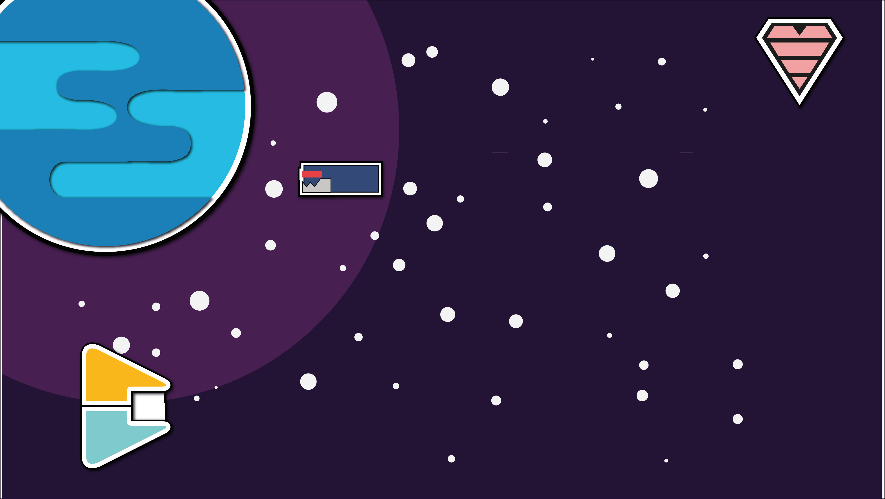

# SINPOSE
## Num longínquo futuro tecnológico, o planeta Terra encontra-se em perigo devido aos destruidores de galáxias, “Os quadriláteros”… Só de ouvir o nome provoca arrepios! Mas, este planeta tem uma “arma” secreta contra os invasores, uma nave de guerra construída com a tecnologia mais avançada e com acesso a armas super… imper… mega… poderosas!
## Oh! Espera. As armas foram proibidas. Não tem armas. [Não tem armas?!] Para destruir os inimigos tem de ir contra eles, mas por favor desvia-te dos asteroides ou perdes “Vidas”!! E, tens poucas.

# COMO JOGAR
## Este jogo é semelhante ao “space invaders”, com elementos de ritmo e sem tiros. O objetivo do jogo é a nave destruir os inimigos, que atacam ao ritmo da música. 
## Fica atento aos inimigos, prevê os ataques e defende o planeta. Perdes “vidas” se deixares o inimigo passar ou quando um asteroide embate na nave. Atenção, só tens quatro “vidas”. Há inimigos mais poderosos e destruidores, os que são mais compridos tiram três “vidas” de uma só vez. Assim, dependendo do tamanho do inimigo, podes perder três, duas ou uma “vida”. Deves estar muito atento! 
## Tenta chegar ao final da música sem perder todas as “vidas”. Diverte-te.

# COMO CONTRUÍMOS
### Paper Test
## [Para a realização deste jogo começamos com uma “partilha” de ideias. De seguida, testámos as nossas ideias usando modelos em papel (paper test) para simular o jogo.](https://youtu.be/z_fZtz_0Q8A)

### Design do projeto
## Foram feitos vários rascunhos, inicialmente em papel e por fim em digital, no Adobe Illustrator, até obtermos um produto que nos agradou. O design final do projeto, resultou assim de várias experiências e da correção de erros que foram encontrados.

## Como podemos ver a seguir:

## Background:

## O jogador (nave):

## As “vidas” do jogador:

## Os inimigos:

## Os obstáculos:

## Depois passámos da fase inicial de paper test para o layout.

## [Vídeo promocional](https://www.youtube.com/watch?v=aNtO9_Arep0)
## [Jogo Teste](https://youtu.be/eBjqIc64Ghs)

## Storyboards:

# Considerações Finais
## Este projeto, jogo “Invasão dos Quadriláteros”, foi realizado para a UC de Design Multimédia, do Curso de Produção Multimédia para a Educação e permitiu-nos aplicar os conhecimentos adquiridos na área do design aplicados à produção multimédia. 
## Este jogo, de estilo “One-Click Game”, cuja temática são “Figuras geométricas”, poderá ser usado somente como entretenimento ou, em contexto educativo, por crianças até aos 12 anos. As diferentes figuras geométricas e os elementos de som/ ritmo existentes no jogo poderão ser utilizados para o treino da memória, melhorar a atenção-concentração dos alunos e desenvolver a motricidade ou capacidade de reação. 
## A publicação deste jogo “Invasão dos Quadriláteros” será feita somente no Github.

### Créditos: Diogo Dionísio e Diogo Alexandre.